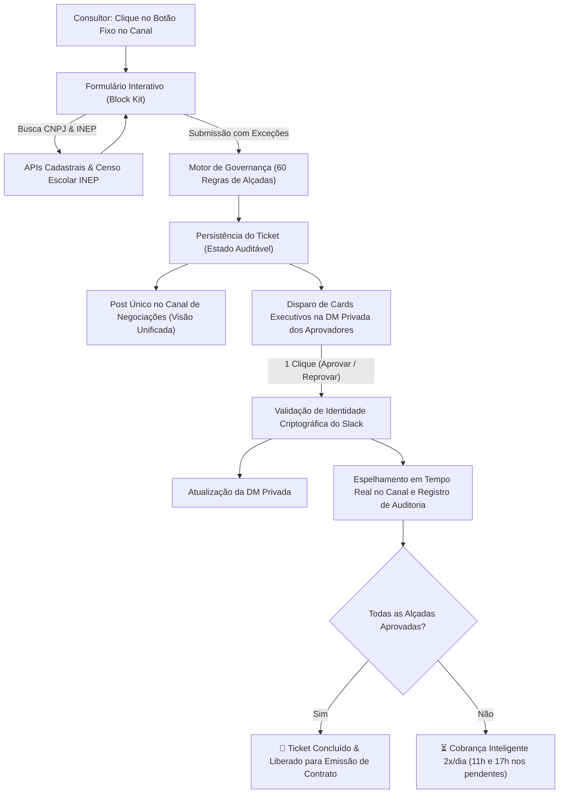

# 🤝 DeAcordo — Central de Aprovações Comerciais & Casos Complexos

Aplicativo nativo para o Slack da **Arco Educação (Ciclo Comercial 2027)** para governança, roteamento automático de alçadas e aprovações em 1 clique, eliminando retrabalho de consultores e filas operacionais de contratos.

---

## 🎯 Principais Benefícios

* **Decisões em 1 Clique via DM Privada:** Cards executivos enviados diretamente para o aprovador no privado do Slack, permitindo aprovação ou reprovação instantânea pelo celular ou desktop.
* **Zero Retrabalho Cadastral:** Preenchimento automático de Razão Social e Código INEP ao digitar o CNPJ da escola (com cruzamento no Censo Escolar Privado).
* **Matriz de Governança Determinística (60+ Regras):** Roteamento automático de alçadas para Líder Direto, Logística, Pedagógico, Produtos, Jurídico, Financeiro e Diretoria N3 sem erro humano.
* **Substituição por Ausência (@triagem):** Módulo de contingência para transferir alçadas temporariamente durante férias ou licenças, com prazo de vigência definido e auditoria na thread.
* **Cobrança Inteligente 2x ao Dia:** Robô de lembretes (11h e 17h, seg-sex) que cobra cirurgicamente apenas os decisores com pendências ativas.
* **Ativação por Botão Fixo no Canal:** Painel permanente com botão interativo no canal, permitindo a abertura de solicitações mesmo com envio de mensagens bloqueado.

---

## 📊 Arquitetura e Fluxo de Dados



---

## 🛠️ Tecnologias Utilizadas

* **Linguagem:** Python 3.12+
* **Framework:** Slack Bolt for Python (`slack-bolt`)
* **Modo de Conexão:** Socket Mode (sem necessidade de expor portas públicas ou IPs externos)
* **Interface:** Slack Block Kit (Modais dinâmicos, blocos interativos e botões de ação)
* **Agendamento:** APScheduler (BackgroundScheduler)
* **Integrações:** Receita Federal, BrasilAPI, Base Local do Censo INEP (`censo_inep.csv`)

---

## 🚀 Como Executar

### 1. Pré-requisitos
* Python 3.10 ou superior instalado.
* App configurado no painel do Slack ([api.slack.com/apps](https://api.slack.com/apps)) com Socket Mode ativado.

### 2. Instalação das Dependências
```bash
pip install -r requirements.txt
```

### 3. Configuração do `.env`
Copie o arquivo de exemplo e configure suas credenciais:
```bash
cp .env.example .env
```
Preencha com seus tokens:
* `SLACK_APP_TOKEN`: Token `xapp-...` com escopo `connections:write`.
* `SLACK_BOT_TOKEN`: Token `xoxb-...` com os escopos `chat:write`, `commands`, `channels:history`, `groups:history`, `reactions:write`.
* `SLACK_CHANNEL_ID`: ID do canal de negociações no Slack.

### 4. Iniciar o Bot
```bash
python bot.py
```

---

## 👥 Estrutura do Projeto

```text
├── bot.py                     # Servidor Bolt Socket Mode com todos os listeners e rotinas
├── config/
│   ├── approvers_map.py       # Tabela de mapeamento de nomes para Slack IDs
│   ├── exceptions_rules.py    # Matriz oficial com as 60 regras de governança e exceções
│   ├── mock_users.py          # Usuários de teste para simulação sem licenças adicionais
│   └── triagem_config.py      # Controle de acesso e permissões do perfil @triagem
├── services/
│   ├── dm_approval_service.py # Disparo e gestão de cards executivos na DM privada
│   ├── inep_service.py        # Busca em cascata e cruzamento com o Censo Escolar
│   ├── receita_service.py     # Consulta de CNPJ com redundância entre APIs
│   ├── substitution_service.py# Gerenciamento de ausências e aprovadores substitutos
│   └── ticket_service.py      # Estado dos tickets, post único e cobrança inteligente
├── utils/
│   └── currency_words.py      # Máscara de moeda em tempo real e cálculo por extenso
├── views/
│   └── modals.py              # Renderização de formulários Block Kit e modais
├── censo_inep.csv             # Base cadastral de escolas privadas do INEP
└── requirements.txt           # Dependências do projeto
```
